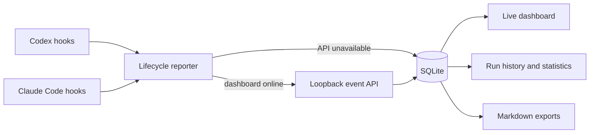

# Lanternwatch

Local-first observability for Codex and Claude Code agent workflows.

[](https://nextjs.org/)
[](https://www.typescriptlang.org/)
[](https://nodejs.org/)
[](https://www.sqlite.org/)

Lanternwatch makes multi-agent coding work visible. It captures lifecycle
events from Codex and Claude Code, correlates them into runs, shows live agent
status and runtimes, stores durable history in SQLite, and can export completed
runs as Obsidian-compatible Markdown.

The application is intentionally local: its server and ingestion API bind to
`127.0.0.1`, and activity data stays on the workstation.

## Highlights

- Live project, workflow, agent, runtime, diagnostic, and event-log views
- Historical runs and activity statistics backed by SQLite
- Codex and Claude Code lifecycle hook integrations
- Stable run, event, and agent-instance correlation across concurrent work
- Bounded API delivery with direct-to-SQLite fallback when the dashboard is off
- Stalled and interrupted run detection
- Optional Markdown exports for Obsidian or any filesystem-based notes workflow
- Configuration-preserving installers with timestamped backups
- Persistent light/dark theme with reduced-motion support

## Architecture



SQLite is the source of truth. Reporters first try the loopback API and fall
back to an idempotent local database write, so observability never blocks the
coding task it observes.

## Engineering details

- **Failure isolation:** hook delivery is detached, bounded, and non-blocking.
- **Idempotency:** stable event identifiers make retries safe.
- **Configuration safety:** installers merge hook definitions, preserve an
  existing Codex notifier, and back up every global file they modify.
- **Portable paths:** defaults resolve from the current user profile; storage,
  database, vault, Codex, Claude, Node, and runtime-config locations can be
  overridden.
- **Local privacy boundary:** the API is unauthenticated by design because it
  is loopback-only. It is not intended for public deployment.
- **Accessible UI:** responsive layouts, keyboard-friendly controls,
  persistent themes, and reduced-motion handling are built in.

## Tech stack

| Layer | Technology |
| --- | --- |
| Web application | Next.js 16 App Router, React 19, TypeScript 7 |
| Persistence | Built-in `node:sqlite` |
| Integration | Node.js lifecycle reporters and PowerShell installers |
| Export | Markdown notes with YAML front matter |
| Verification | Node test runner, TypeScript, Next.js production build |

## Quick start

### Requirements

- Windows and PowerShell
- Node.js 24 or newer
- npm

```powershell
git clone https://github.com/postedpecan/lanternwatch.git
cd lanternwatch
npm ci
Copy-Item .env.example .env.local
npm run dev
```

Open <http://127.0.0.1:3000>.

The default database is `%USERPROFILE%\.lanternwatch\guild.db`. Path settings
in `.env.local` are optional; set `LANTERNWATCH_VAULT_PATH` if you want the web
application to export completed runs as Markdown.

## Configuration

| Variable | Purpose |
| --- | --- |
| `LANTERNWATCH_STORAGE_ROOT` | Runtime state and lifecycle logs; defaults to `~/.lanternwatch` |
| `LANTERNWATCH_DB_PATH` | Explicit SQLite database file |
| `LANTERNWATCH_VAULT_PATH` | Optional Markdown/Obsidian export destination |
| `LANTERNWATCH_STALE_AFTER_SECONDS` | Idle time before an open run appears stalled; default `600` |
| `LANTERNWATCH_API_URL` | Reporter ingestion endpoint; defaults to the loopback API |
| `LANTERNWATCH_CONFIG_PATH` | Optional shared runtime configuration file |
| `LANTERNWATCH_RESEARCH_DB_PATH` | Technical Researcher/Market Intelligence Analyst research database; defaults to `<project>/.lanternwatch/research.db` |
| `LANTERNWATCH_RESEARCH_VAULT_PATH` | Research-note destination; defaults to `D:\VibeCoding\Vibe Coding\Wiki\Lanternwatch` |

The installers persist resolved paths to `~/.lanternwatch/config.json` so
background reporters and the dashboard can share the same locations.
Environment variables take precedence over that file.

## Research archive

Every terminal Technical Researcher or Market Intelligence Analyst investigation produces one structured
public-source record. The main agent passes that JSON package to:

```powershell
npm run research:capture -- --file .\path\to\research-result.json
```

SQLite is authoritative. A capture is inserted once by stable task ID, marked
`pending`, and then exported as a deterministic dated Markdown note. Export
failures leave a retryable `failed` row and print a sanitized warning without
discarding the research. The next capture retries all pending/failed notes;
manual retry is also available:

```powershell
npm run research:retry
```

Only public HTTP(S) sources are accepted. Notes contain YAML metadata, the
research question, executive summary, verified findings, caveats, source
links, and short supporting excerpts. Existing vault notes are never indexed
or backfilled, and complete webpages, raw prompts, private conversation,
credentials, commands, local paths, and reasoning traces are not stored.

## Your Codex agents

LanternWatch does not install or take ownership of Codex agents. The Agents
page separates global and workspace definitions, registered external TOMLs,
and this project's LanternWatch definitions. LanternWatch definitions are
visible with a `LanternWatch` tag but read-only. You can create, rename, tag,
or temporarily disable your own global and workspace agents.

Discovery is manual by default: the catalog changes only after **Refresh
agents** or another direct catalog action. In Settings, **Automatic - scan once
now** performs one immediate scan when saved; it does not watch folders, poll,
or scan in the background. You can also register any readable local TOML. An
external TOML is tracked only until you choose **Add to Codex**, which copies it
to a global or workspace Codex folder without changing the original file.
Restart Codex after changing an agent file so the host can discover the new
definition.
The current project's `AGENTS.md` remains applicable, and project agents with
matching names take precedence over personal agents. See the official
[Codex custom-agent documentation](https://learn.chatgpt.com/docs/agent-configuration/subagents).

## Connect lifecycle events

These commands modify global agent configuration. Each installer creates
timestamped backups and preserves unrelated hooks and notifier settings.
Review the scripts before running them.

### Codex

```powershell
npm run guild:install
```

The installer resolves `CODEX_HOME` or defaults to `~/.codex`, finds Node on
`PATH`, reads Lanternwatch path overrides from the process environment or
`.env.local`, merges lifecycle hooks, and leaves existing Codex notifier
configuration unchanged. After installation, start the Codex CLI in this project and use
`/hooks` to review and trust the definitions. Restart desktop or IDE hosts so
they reload the global configuration.

If the dashboard and background hooks were installed at different times or
show different storage roots, repair only their shared runtime paths without
resetting hook trust or notifier configuration:

```powershell
npm run guild:repair-runtime
```

Older Lanternwatch releases used Codex's completion-only `notify` setting as a
fallback. It cannot report live subagents and newer payloads can exceed the
Windows command-line limit. Remove only that legacy Lanternwatch layer while
preserving any surrounding notifier:

```powershell
npm run guild:repair-notifier
```

For one guarded recovery workflow, run the command with no flags first. This
is a non-mutating preflight: it resolves and prints one shared storage,
database, vault, and runtime-config tuple but does not run repair scripts,
change global configuration, stop processes, or delete Lanternwatch data.

```powershell
npm run guild:recover
```

After saving all work, the real workflow requires both confirmation guards. It
repairs runtime paths, Codex hooks, and the obsolete Lanternwatch notifier layer
before invoking the exact-process restart helper for ChatGPT and Codex only.
It neither edits Claude Code hooks nor stops or restarts Claude. Existing
installer backups and rollback behavior remain in effect; databases, logs,
sessions, backups, vault files, and unrelated hook/notifier configuration are
preserved. Add `-RestartDashboard` only when the identified local development
dashboard should also restart.

```powershell
npm run guild:recover -- -Force -Confirm -RestartDashboard
```

Forced host termination can lose unsaved chats and work. The command never
automates keyboard input or trust decisions. After it finishes, reopen Codex,
run `/hooks` in the Codex CLI, trust and enable all five Lanternwatch handlers,
fully restart Codex after trust, and send a prompt in a fresh chat. Start a new
`logs\hook.jsonl` entry under the printed storage root is runtime proof;
configuration presence alone is not.

### Restart desktop hosts after hook changes

The safe default is a preview: it only lists the exact ChatGPT, Codex, and
Claude process names it would target, records any readable executable paths,
and does not stop or launch anything.

```powershell
npm run guild:restart-hosts -- -WhatIf
```

For a real restart, run this from a normal PowerShell window rather than a
Codex or Claude terminal. It force-closes only the allowed host processes,
relaunches only executable paths it recorded before stopping them, optionally
restarts an identified local-project Next development server, and opens a new
PowerShell in this project running `codex`. **Forced termination loses unsaved
chats and work, including unrelated chats.** The `-Confirm` prompt is required;
once the new CLI is ready, enter `/hooks` yourself.

```powershell
npm run guild:restart-hosts -- -Force -Confirm -RestartDashboard
```

If a host executable path or a local Next development process cannot be safely
identified, the helper warns and leaves that component alone. It never kills
generic `node`, `npm`, or wildcard process groups.

Custom locations can be passed directly:

```powershell
powershell -ExecutionPolicy Bypass -File scripts/install-lanternwatch.ps1 `
  -StorageRoot "D:\Lanternwatch" `
  -VaultPath "D:\Notes"
```

### Claude Code

```powershell
npm run guild:install:claude
```

The Claude installer merges global lifecycle hooks into
`~/.claude/settings.json`, updates the global instructions, and preserves both
files before editing. Start a new Claude Code session afterward.

### Manual reporting

Use the company-title slug as the agent ID. Legacy fantasy IDs are still
accepted as input aliases and are normalized before an event is sent or stored.

```powershell
npm run guild:report -- --status working --agent systems-analyst --run-id example-run --project "C:\path\to\project" --message "Inspecting the project"
npm run guild:report -- --status complete --agent systems-analyst --run-id example-run --project "C:\path\to\project" --message "Inspection complete" --run-complete
```

Persisted integrations can also send events to:

```text
POST http://127.0.0.1:3000/api/guild/events
```

`window.guildHall.push(...)` and `window.guildHall.start(...)` are browser-only
demo helpers. They update client state but do not persist events.

## Commands

| Command | Purpose |
| --- | --- |
| `npm run dev` | Start the local development server |
| `npm run build` | Create a production build |
| `npm run start` | Serve the production build on loopback |
| `npm test` | Run lifecycle, hook, diagnostic, and formatting tests |
| `npm run guild:report` | Submit a manual lifecycle event |
| `npm run guild:simulate` | Simulate lifecycle activity locally |
| `npm run guild:rehook` | Reinstall Codex hooks and reset trust records |
| `npm run guild:repair-runtime` | Align background hooks with the dashboard runtime paths |
| `npm run guild:repair-notifier` | Remove only the obsolete Lanternwatch completion notifier |
| `npm run guild:recover` | Preview the guarded all-in-one lifecycle recovery without changing anything |
| `npm run guild:recover -- -Force -Confirm -RestartDashboard` | Repair lifecycle configuration, then force-restart exact guarded hosts; loses unsaved work |
| `npm run guild:restart-hosts -- -WhatIf` | Preview a guarded desktop-host restart |
| `npm run guild:restart-hosts -- -Force -Confirm -RestartDashboard` | Force-restart host apps and an identified local dev server; loses unsaved work |
| `npm run research:capture -- --file <json>` | Persist and export one research result |
| `npm run research:retry` | Retry pending or failed research-note exports |
| `npm run build:sprites` | Rebuild optional sprite assets |

## Security model

Lanternwatch is a trusted local tool, not a hosted multi-user service. The
event, dashboard, and health routes do not authenticate requests and may expose
local activity or filesystem diagnostics. Keep the server bound to loopback;
do not expose it through a public host, tunnel, reverse proxy, or `0.0.0.0`
without first adding authentication and response redaction.

See [SECURITY.md](SECURITY.md) for reporting guidance.

## Project structure

```text
app/                  Next.js pages and local API routes
components/guild/     Live dashboard, history, diagnostics, and UI state
lib/server/           SQLite persistence, queries, statistics, and exports
scripts/              Lifecycle hooks, reporters, installers, and simulations
Agents/               Lanternwatch specialist role specifications
public/guild/          Runtime visual assets
```

## Verification

The public-ready release is verified with:

```powershell
npm test
npx tsc --noEmit
npm run build
```

## Project status

Lanternwatch is an active portfolio project optimized for a single Windows
workstation. Natural next steps are a redacted read-only demo mode, broader
cross-platform installers, and authenticated remote access.

Built by [@postedpecan](https://github.com/postedpecan).

## License

No open-source license has been selected yet. The source is publicly viewable,
but no reuse rights are granted until a license is added.
